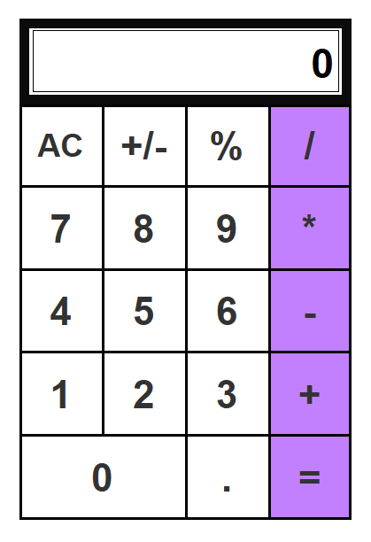

# Calculator UI Prototype

This is a simple calculator user interface (UI) prototype created using **Axure RP**. The prototype simulates the layout and interaction design of a basic calculator.

## 📁 Project File

- **File Name:** `CalculatorUI.rp`
- **Created With:** Axure RP
- **Purpose:** UI/UX design prototype for a basic calculator

## 🧮 Features Included

- Numeric keypad (0–9)
- Basic operations: Addition, Subtraction, Multiplication, Division
- Equal button to compute result
- Clear button to reset inputs
- Display screen to show input and result

## 📸 Demo

## 🚀 How to Open

1. Install **Axure RP** (https://www.axure.com/)
2. Open `CalculatorUI.rp` using the Axure RP application
3. Preview the prototype using Axure’s built-in preview or export options

## 🛠️ Technologies Used

- Axure RP (UI/UX prototyping tool)

## 📌 Notes

- This is a non-functional prototype meant for design and demonstration purposes.
- Functional logic (like actual calculations) is not implemented in this prototype.

## 📃 License

This project is licensed under the MIT License — see the [LICENSE](LICENSE) file for details.
